# Apresentação da Solução

Com base nos problemas identificados e nos requisitos levantados ao longo deste projeto, apresentamos a seguir a proposta de solução desenvolvida pelo grupo.

## Apresentação de Slides:

  
Clique para ver a apresentação

  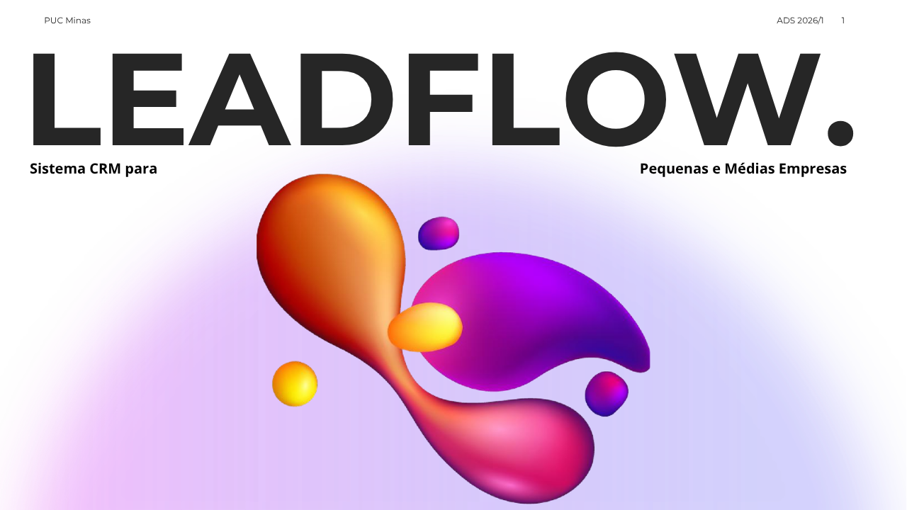  
  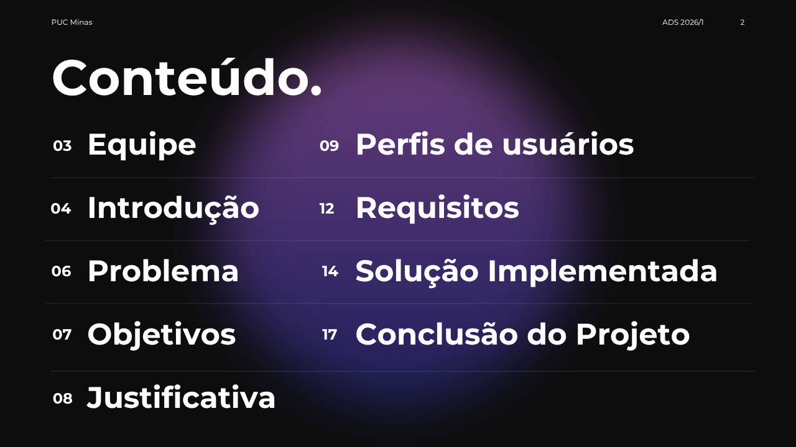  
    
  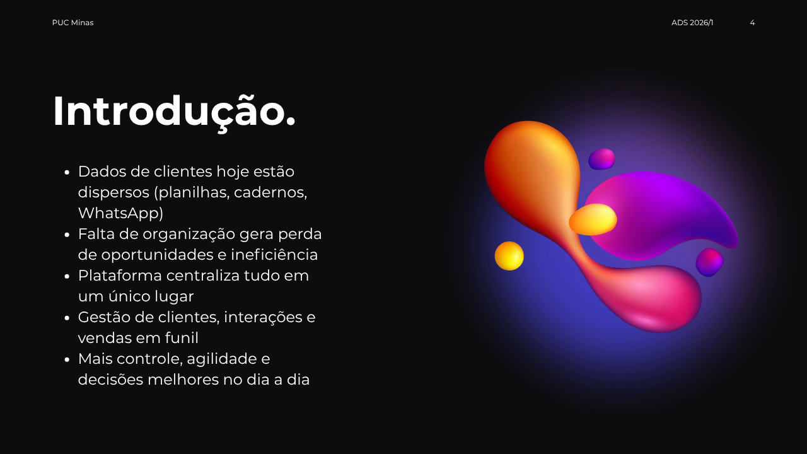  
    
  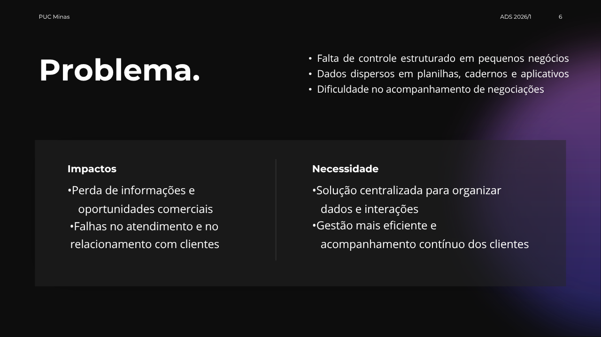  
  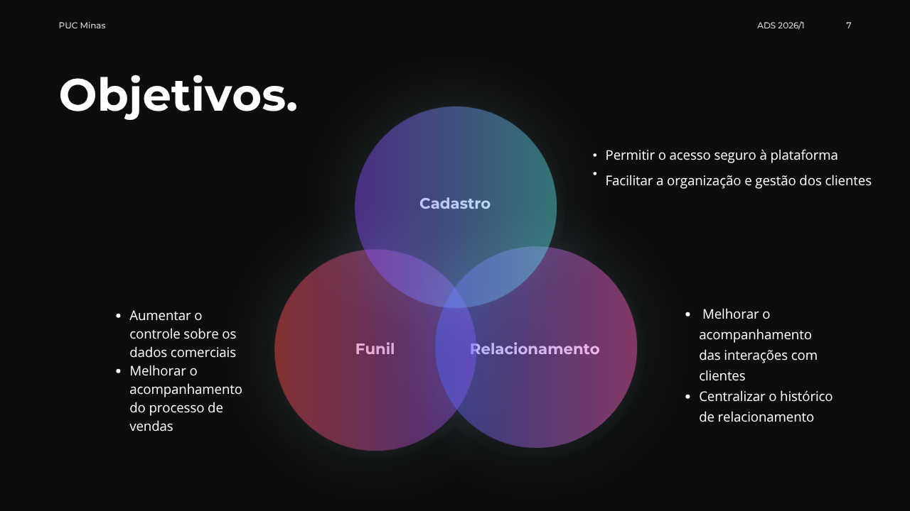  
  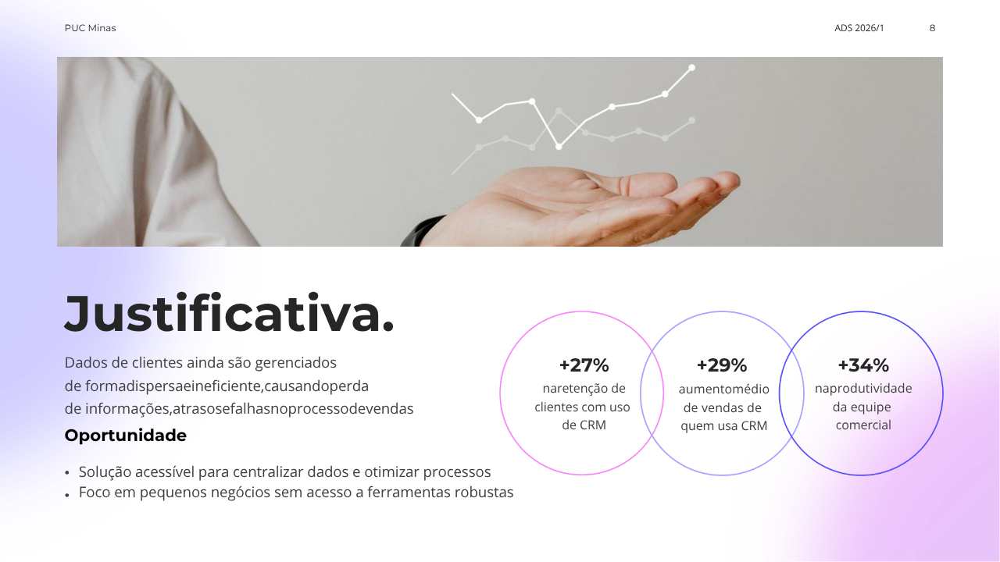  
  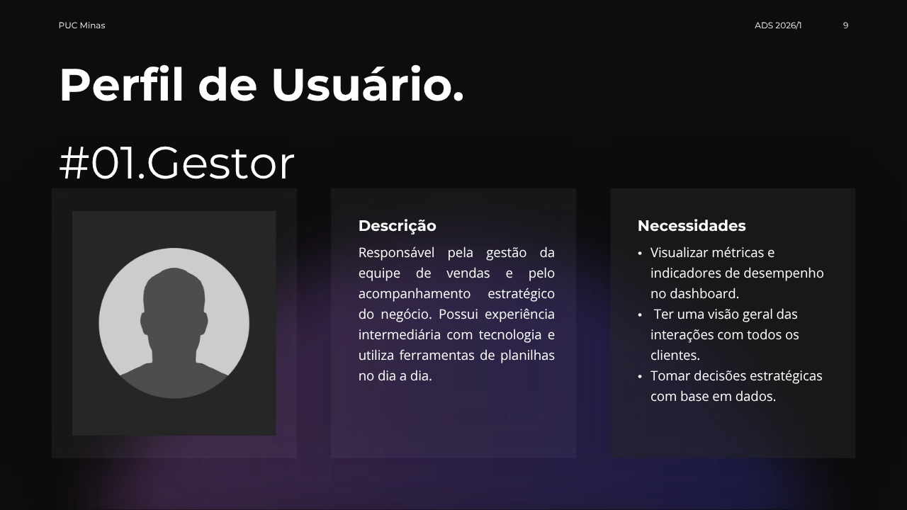  
  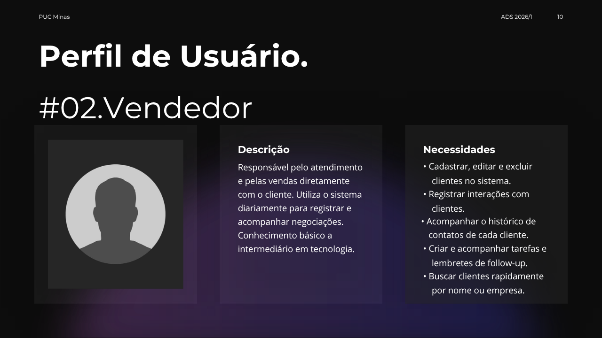  
  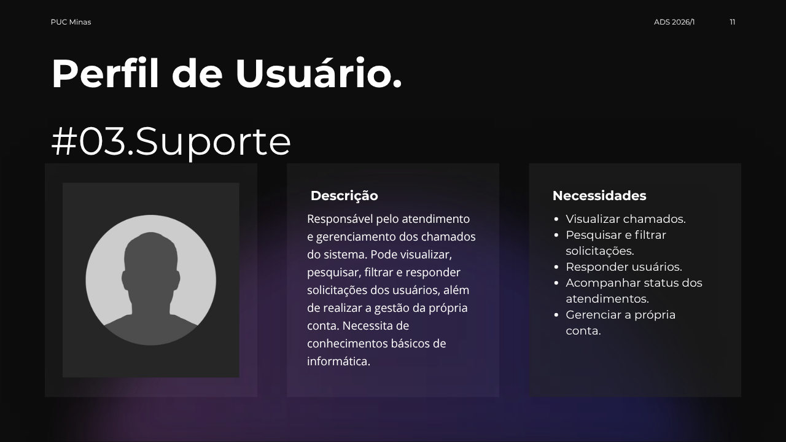  
  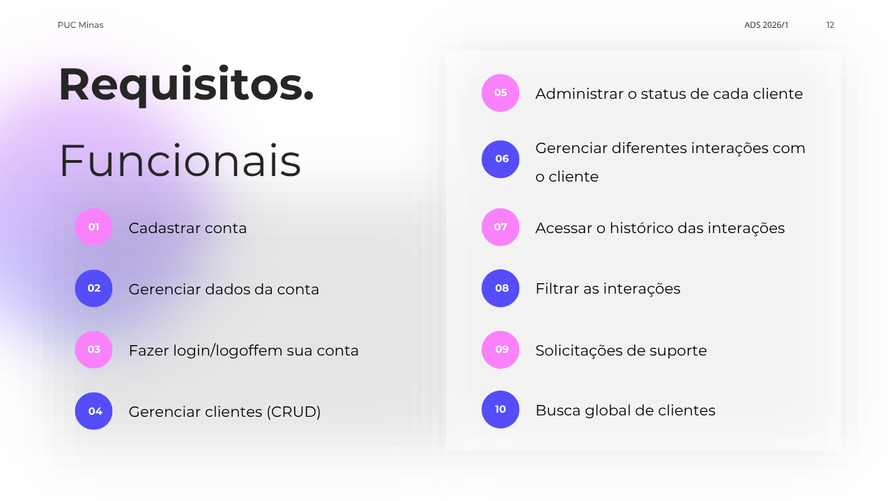  
  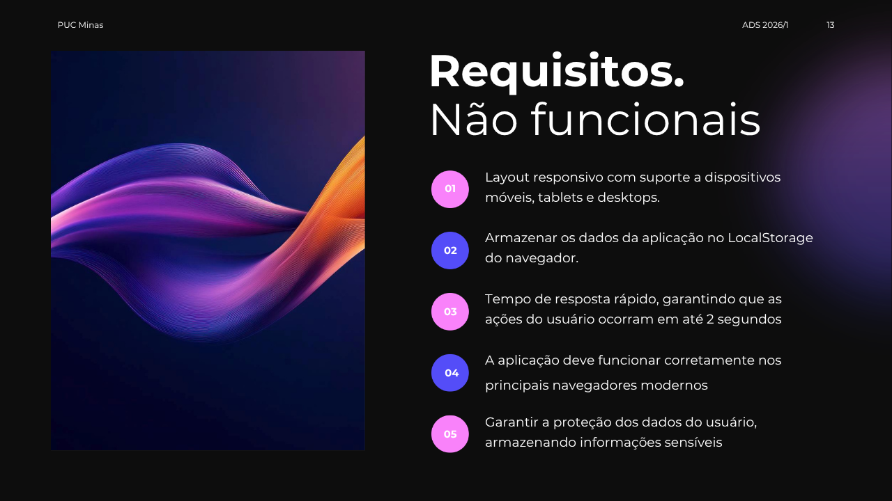  
  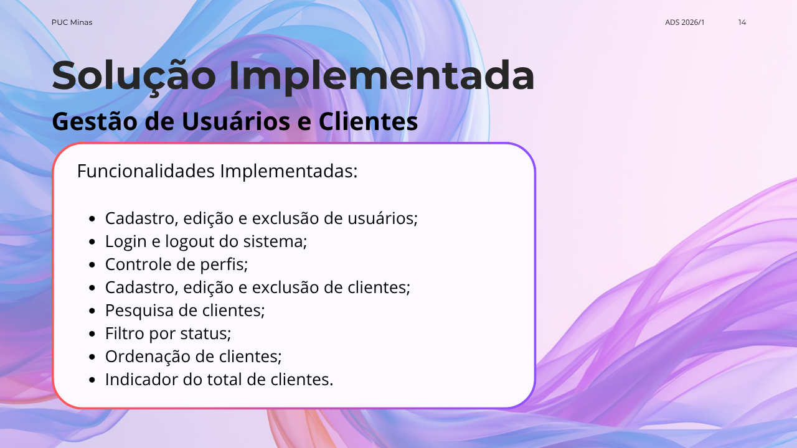  
    
  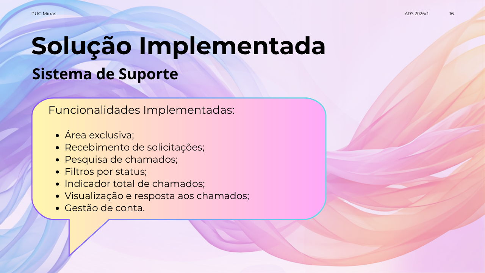  
  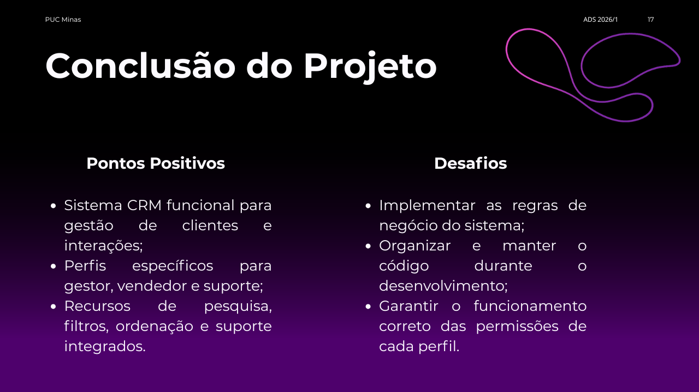  
  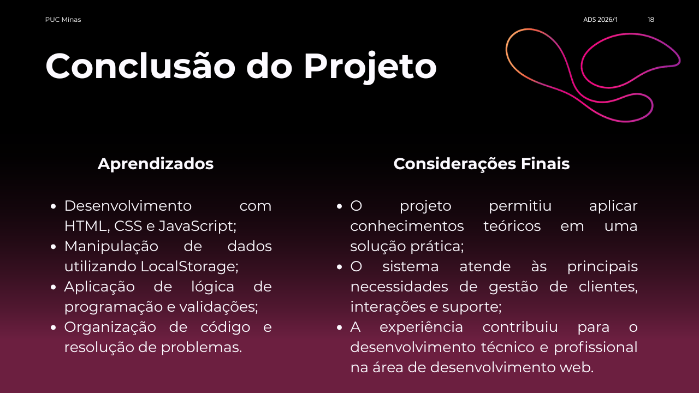  
    
    
  

**Download da apresentação de slides em PDF:** [Apresentação LeadFlow.pdf](https://github.com/user-attachments/files/29181725/Apresentacao.LeadFlow.pdf)

## Vídeo de apresentação das funcionalidades

https://github.com/user-attachments/assets/590b949e-7ee4-4558-a584-35fbbd369ab7

## Hospedagem

A aplicação em HTML/CSS/JS é um projeto que pode ser utilizado tanto em servidores como em navegadores web. Clique <a href="https://icei-puc-minas-pmv-ads.github.io/pmv-ads-2026-1-e1-proj-web-t03-leadflow/codigo-fonte/pages/">aqui</a> para acessá-lo.

